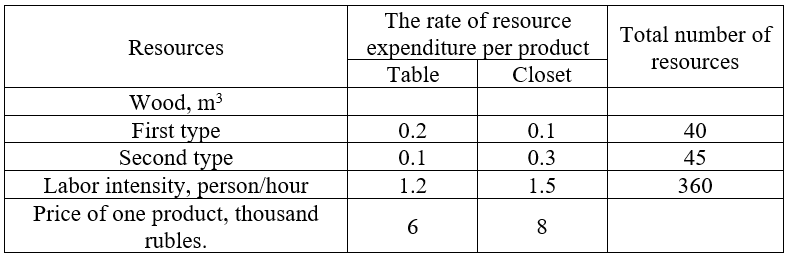

To produce tables and cabinets, a furniture factory uses the necessary resources. The rates of resource expenditure for
one product of a given type, the prices of products and the total amount of available resources are shown in the table.

1. Assuming that the sale of finished products is ensured, determine how many tables and cabinets the factory should produce in order for the income from their sale to be maximized.
2. Determine which resource increases are most beneficial for the factory and why.
3. How will the decision change if the supply of wood of type 1 increases by 10 m3?
4. Will the decision change if the price of one table increases by 4 thousand rubles?