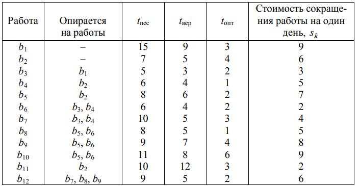

1. Construct a network diagram for the maximum (tпес) duration of all his works, calculate the earliest and
   most
   late dates for the occurrence of events, find the critical path, determine the complete and independent time reserves
   of all work and the intensity coefficients of non-critical arcs.
2. For a three-parameter model, it is not possible to find the expected completion time of the project and determine the
   probability of project completion.
   later than the given deadline, find the interval of guaranteed (with probability P = 0.9973) project completion time,
   estimate the maximum possible project completion time with a given reliability.

   Perform the same calculations for the two-parameter model.
   Compare results.
3. Considering tпес as the duration of work with the minimum permissible intensity (tпес = t
   max), and tопт as the duration of work with the maximum possible intensity (tопт = t
   min), find
   the most cost-effective option for completing the project.

   Minimize the cost of the project at the lowest possible
   the deadline for its execution.

The directive (specified) deadline for the project is Tдир = 29 days.

Target reliability &gamma; = 0.90.

The cost of one day of the project is equal to 10 monetary units: S = 10.