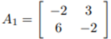
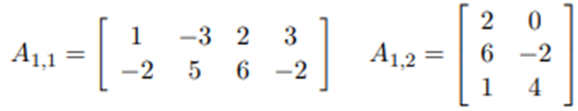
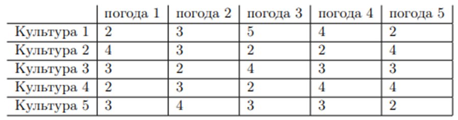
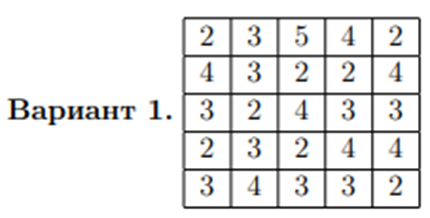
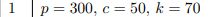

Task 1. Find the solution to the game given by the matrix Ai:

Task 2. Find the solution to the games specified by the matrices Ai1 and Ai2:

Task 3. Sowing planning.

• The farmer needs to determine in what proportions to sow his field with 5 crops, if the yield of these crops, and, therefore, profit, depends on what the summer will be like: cool and rainy, normal, or hot and dry.

• The farmer calculated the net profit per 1 hectare from different crops depending on the weather:

• Here the farmer has no real opponent.

• But, if the farmer plans his activities based on the worst weather conditions, then Nature can be considered an active agent who is trying to create the worst weather (from the farmer’s point of view).

• In this case, we can model the farmer's problem as a matrix game in which the farmer is player 1 and Nature is player 2.

• The payoff matrix A for this game is the farmer's income table.

Task 4. The store has a certain stock of minimum assortment goods. If
the stock of goods is insufficient, it is necessary to get it from the base; if the supply exceeds demand, then
The store bears the costs of storing unsold goods. Let the demand for goods lie in
within S 5 ? S ? 8 units, the cost of storing one unit of goods is c rub., and
costs for importing a unit of goods k rub., the price per unit of goods is p rub. Compose
payment matrix, the elements of which are the store’s profit (income from sales with
taking into account storage or delivery costs). Determine the optimal store strategy
for the import of goods, using the criteria of Wald, Savage, Hurwitz with &alpha; = 0.5, Laplace.

